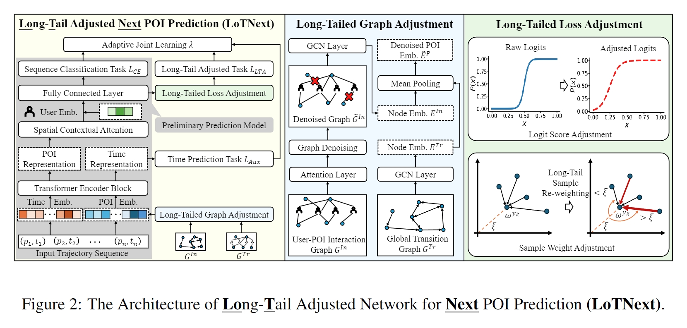

# [NeurIPS 2024] Taming the Long Tail in Human Mobility Prediction

<p align="center">
    <a href="https://arxiv.org/abs/"></a>
    <a href="https://neurips.cc/"></a>
    <a href="https://github.com/Yukayo/LoTNext/blob/main/LICENSE"></a>
    
</p>

# :information_desk_person: Introduction

Thank you for your interest in our work **LoTNext**, published in the paper *[Taming the Long Tail in Human Mobility Prediction](https://arxiv.org/abs/2402.14744)*. 



This work is the first to propose a general framework for the next POI prediction under the long-tail problem.


# 💻 Environments
```
conda create -n LoTNext python==3.8
conda install pytorch==1.13.1 torchvision==0.14.1 torchaudio==0.13.1 pytorch-cuda=11.7 -c pytorch -c nvidia
conda install pyg -c pyg
```

# 📂 Data Preparation

**Note: For steps 1 and 2, choose one to execute.**

**1. place [check-in_data.zip](https://drive.google.com/file/d/1WzwP6NFZ3rvSFLy8rXzhuqzM_MgNJFmF/view?usp=sharing) into ./data/ and unzip the file as follows:**

./data/checkins-gowalla.txt

./data/checkins-4sq.txt

Note: These are raw check-in datasets, if you want to change the preprocess rules, you need to comment out these codes of train.py as follows:
```
with open(setting.loader_file, 'rb') as f:
    poi_loader = pickle.load(f)
```
In addition, restore these commented codes of train.py, as follows:
```
# load dataset
# poi_loader = PoiDataloader(
#     setting.max_users, setting.min_checkins)  # 0， 5*20+1
# poi_loader.read(setting.dataset_file)
```

**2. place [check-in_dataloader.zip](https://drive.google.com/file/d/12yvZ7ClT3klDNI2cqIYyBhpAFV6pQntC/view?usp=sharing) into ./data/ and unzip the file as follows:**

./data/poi_loader-gowalla.pkl

./data/poi_loader-4sq.pkl

Note: Unzip, you don't need to comment out any codes.

**3. place [Graphs.zip](https://drive.google.com/file/d/1nj916wbuRvSLKPB8ddqktmpVYbkSIa4y/view?usp=sharing) into ./KGE/POI_graph/ and unzip the file as follows:**

./KGE/POI_graph/gowalla_scheme2_transe_loc_temporal_100.pkl


# ▶️ Model Training

- Gowalla
```
python train.py --dataset checkins-gowalla.txt --dataloader poi_loader-gowalla.pkl --trans_loc_file ./KGE/POI_graph/gowalla_scheme2_transe_loc_temporal_100.pkl --trans_interact_file ./KGE/POI_graph/gowalla_scheme2_transe_user-loc_100.pkl --log_file ./results/log_gowalla --model_file ./model_log/model_gowalla

```
- Foursquare
```
python train.py --dataset checkins-4sq.txt --dataloader poi_loader-4sq.pkl --trans_loc_file ./KGE/POI_graph/foursquare_scheme2_transe_loc_temporal_20.pkl --trans_interact_file ./KGE/POI_graph/foursquare_scheme2_transe_user-loc_100.pkl --log_file ./results/log_foursquare --model_file ./model_log/model_4sq

```

# :bookmark_tabs: Citation

If you are interested in our work, please cite it as:
```
@article{xu2024taming,
  title={Taming the Long Tail in Human Mobility Prediction},
  author={Xu, Xiaohang and Jiang, Renhe and Yang, Chuang and Fan, Zipei and Sezaki, Kaoru},
  journal={Advances in Neural Information Processing Systems},
  volume={},
  pages={},
  year={2024}
}

```
If you have any questions, please contact `xhxu@g.ecc.u-tokyo.ac.jp` or publish the new issues. (English, Chinese, and easy Japanese are ok for me :neckbeard:) 

## :couplekiss: Acknowledgement

This work is partly based on [Graph-Flashback](https://github.com/kevin-xuan/Graph-Flashback) and [Flashback](https://github.com/eXascaleInfolab/Flashback_code). We sincerely thank their great works and cite them in the paper. 🙇‍♂️


