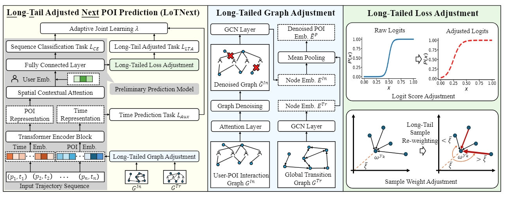

# Taming the Long Tail in Human Mobility Prediction

# Environmentss
```
conda create -n LoTNext python==3.8
conda install pytorch==1.13.1 torchvision==0.14.1 torchaudio==0.13.1 pytorch-cuda=11.7 -c pytorch -c nvidia
conda install pyg -c pyg
```

# Model Training

Gowalla
```
python train.py --dataset checkins-gowalla.txt --dataloader poi_loader-gowalla.pkl --trans_loc_file ./KGE/POI_graph/gowalla_scheme2_transe_loc_temporal_100.pkl --trans_interact_file ./KGE/POI_graph/gowalla_scheme2_transe_user-loc_100.pkl --log_file ./results/log_gowalla --model_file ./model_log/model_gowalla

```
Foursquare
```
python train.py --dataset checkins-4sq.txt --dataloader poi_loader-4sq.pkl --trans_loc_file ./KGE/POI_graph/foursquare_scheme2_transe_loc_temporal_20.pkl --trans_interact_file ./KGE/POI_graph/foursquare_scheme2_transe_user-loc_100.pkl --log_file ./results/log_foursquare --model_file ./model_log/model_4sq

```